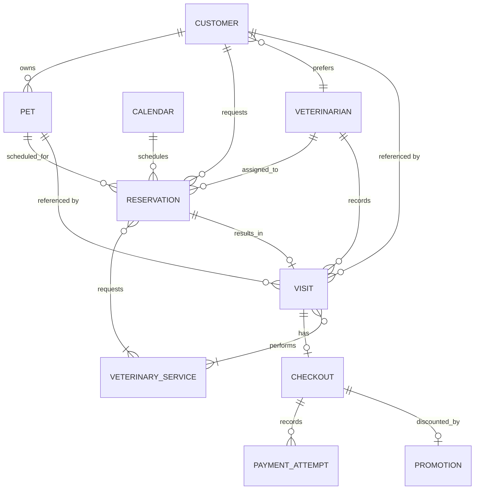

# SPEC-02 — Clinic domain model

Status: core domain decisions accepted. Clinical storage is assigned to Reservation
as the agent-selected service boundary under the user's instruction to proceed.
Transport schemas and executable specifications remain to be finalized; this is
not a claim of implemented application behavior.

## Shared conventions

Customer, Pet, Veterinarian, Reservation, Visit, VeterinarianService, and Checkout
each have a stable `id`. IDs are opaque references, not names or array positions.
Use UUID strings for the new model and deterministic UUIDs in specification seed
data; existing baseline numeric IDs are not migrated by this documentation change.
Money is integer cents in USD. Dates use ISO date strings; timestamps use ISO 8601
with an offset, interpreted against the America/Chicago clinic calendar.

## Customer

SPEC-05 self-registration revision: `POST /auth/register` requires every customer
profile field, including secondary contact, insurance, billing address and saved
mock payment reference, a preferred seeded veterinarian, and at least one pet.
The caller supplies new pet UUIDs to link insurance within the one request; the
service assigns customer/user IDs and pet ownership. Registration is atomic and
creates only a customer login, profile, and pets; it creates no appointment or bill.
The existing veterinarian-assisted `CustomerCreate` and historical seed profiles
retain their original shape. Optional labels below describe those existing shapes,
not the stricter `CustomerRegistration` request. No additional UI/setup flow is added.
Pet removal/archival is deferred to DATA-01; no removal endpoint exists in this MVP.

| Field | Meaning |
| --- | --- |
| id | Stable customer identifier |
| firstName | Customer's first name |
| lastName | Customer's last name |
| phoneNumber | Phone number, represented as text |
| address | Address object defined below |
| pets | Collection of the customer's pets |
| outstandingBalance | Total outstanding USD balance across all of the customer's pets |
| insurance | Optional collection of policies linked to covered petIds |
| emergencyContact | Contact object |
| secondaryContact | Optional Contact object |
| billing | Optional Billing object; electronic method need not be stored for cash-only customers |
| accountEntries | Per-visit amounts owed and credited; source of derived outstandingBalance |
| preferredVeterinarianId | Required. Veterinarian chosen when creating the profile; default for new reservation requests, which may override it (D-17) |

Customer and owner are the same entity (D-21). A reservation request from a customer
with a positive outstanding balance is stored as Denied with denialReason
"Please pay your full balance of $X", X formatted like `1,234.50` (D-20, D-27).

Customer owns account balances. A positive outstanding balance blocks new booking;
zero preserves good standing. Paying one pet's balance does not erase another pet's
unpaid amount. Amounts use integer cents in APIs (for example, 3500 means $35.00).
The balance is maintained through account operations, not a client-editable profile
field. This is a proposed API boundary protecting the already agreed balance rule.

Customer can have zero pets and exists independently of any reservation (D-38).
Customer holds no reservations or visits; those records reference the customer and
are owned by Reservation. Historical records keep the original customer reference if
ownership ever changes; transfers are outside this demo.

### Contact and insurance value objects

| Object | Fields |
| --- | --- |
| Address | street, optional secondLine, city, two-letter US state, postalCode (ZIP or ZIP+4) |
| Contact | name, phone, relationship |
| Billing | Optional mockMethodReference, required billingAddress (Address) when Billing is present |
| InsurancePolicy | provider, policyNumber, coveredPetIds[] |

Phone and postal codes are strings. An absent insurance collection is represented
as an empty array in the proposed contract. Policies reference the customer's pets;
there is no claims processing and all billing data is synthetic.
Addresses are US-only. Billing address may be copied from the customer address;
the copy does not change automatically with later customer-address edits. Electronic
payment attempts require a mock method reference even when none is stored on the
customer. Cash-only customers need not store an electronic payment method.

## Pet

| Field | Meaning |
| --- | --- |
| id | Stable pet identifier |
| name | Pet's name |
| type | Required nonblank text such as cat or dog; not limited to those examples |
| breed | Required breed text; Unknown is allowed |
| estimatedBirthDate | Required estimated birth date, not in the future; replaces stored age |
| owner | The customer who owns the pet |

A customer can own multiple pets; each pet has one owner in this demo model.
A pet's visit history and a customer's visits across pets are queries on Reservation
(`GET /visits?petId=`, `GET /visits?customerId=`), not fields of Pet or Customer (D-38).
Neither query creates a second clinical record.

## Visit

SPEC-05 revision: the assigned veterinarian may correct clinicalNotes, diagnoses,
medications, and followUpNotes after CompletedSettled or CompletedOutstanding.
PATCH `/visits/{visitId}` accepts only these clinical fields. It preserves all
other visit fields, reservation state, performed services, finalized checkout,
payments, and customer debt. Other veterinarians and customers cannot correct
the record. This endpoint rejects visits whose reservation is not completed.

| Field | Meaning |
| --- | --- |
| id | Stable visit identifier |
| reservationId | Required reference; one reservation has zero or one visit, and walk-ins are excluded |
| customer | Customer associated with the visit |
| pet | The single pet receiving care |
| veterinarian | Veterinarian responsible for the visit and its clinical record |
| performedServices | Nonempty collection of performed service references |
| clinicalNotes | Required nonblank plain text describing the visit and interactions |
| diagnoses | Array of plain-text diagnoses |
| medications | Array of plain-text medication notes for the demo |
| followUpNotes | Optional plain-text follow-up notes |
| startedAt | Actual visit start timestamp |
| endedAt | Optional actual visit end timestamp |

Performed services record actual care; Reservation.requestedServices records the
request. Both collections must be nonempty, contain unique catalog service IDs, and
use quantity one per service. Performed services may differ from requested services;
they need not be a subset, but must reference valid catalog entries.
Diagnoses and medications may be empty; followUpNotes is optional.

## Veterinarian

Fields: `id`, `firstName`, `lastName`, `officeId`. Each veterinarian has one office;
the demo has two veterinarians. These are domain identifiers and do not introduce
a separate Office service. The veterinarian owns the clinical record as a domain
responsibility. Reservation owns the Visit records and exposes their read/write
interfaces; Customer and Pet histories are read projections of those records.

Synthetic seed data is in [veterinarians.json](../../spec/seed-data/veterinarians.json)
(the catalog with fixed service IDs is in [services.json](../../spec/seed-data/services.json);
seed customers Jordan Rivera (Milo, Luna) and Sam Lee (Rex) are in
[customers.json](../../spec/seed-data/customers.json), with demo logins in
[users.json](../../spec/seed-data/users.json)): Avery
Taylor in office-1 and Morgan Reed in office-2. The file is specification seed data;
the current application does not load it yet.

A visit and reservation are distinct records. Cancellation releases the reservation
slot and preserves clinical history. Creating a reservation alone must not invent
a completed clinical visit. Every visit ends in checkout, including zero due.

## Reservation

| Field | Meaning |
| --- | --- |
| id | Stable reservation identifier |
| calendar | Reference to the clinic calendar and selected appointment slot |
| veterinarianId | Exactly one veterinarian; required at request time |
| bookingFeeAmount | $20 USD (2000 cents), paid at acceptance and non-refundable |
| bookingFeePaid | Whether the booking fee has been paid; does not mean the service bill is settled |
| bookingPaymentId | Payment reference; nullable before booking payment |
| customer | Customer requesting the reservation |
| pet | One pet belonging to that customer, retained from D-01 |
| scheduledStart | Scheduled appointment start timestamp |
| scheduledEnd | Scheduled appointment end timestamp, one hour after start |
| requestedAt | Request creation timestamp |
| acceptedAt | Nullable acceptance timestamp |
| reservationState | Requested, Accepted, Denied, Canceled, CompletedSettled, CompletedOutstanding |
| requestedServices | Nonempty collection of requested veterinary service references |
| denialReason | Null unless Denied; "Please pay your full balance of $X" for automatic balance denials (D-20, D-27) |

Each reservation occupies one one-hour slot, regardless of the number of requested
services under the current duration rule. Accepted reservations consume capacity;
Requested reservations do not. One veterinarian cannot have overlapping accepted
reservations. Acceptance must enforce capacity atomically: concurrent contenders
cannot both win the same veterinarian/slot. The other veterinarian can accept a
different reservation at the same time. Cancellation releases the assigned slot
and preserves clinical records and the already-paid fee.

scheduledStart/scheduledEnd identify the appointment; requestedAt/acceptedAt identify
lifecycle events. These names and meanings are now user-approved.

The assigned veterinarian accepts or denies their own requests (D-16). A request
with scheduledStart in the past, on a weekend, during lunch, or at a non-slot hour
is rejected (D-18, D-22). A pet cannot hold overlapping Accepted reservations,
even with different veterinarians; this is checked at request and at acceptance
(D-25). Cash payments are recorded manually by the veterinarian
and never call the fake payment provider (D-19).

Acceptance requires the $20 booking fee to be paid first (D-23). Reservation asks
Checkout to collect it; Checkout owns every payment record (D-32).
Reservation does not validate requested service IDs against the catalog (D-37);
Checkout prices performed services and rejects unknown IDs when the veterinarian
finalizes the bill (D-36). A failed booking
payment leaves the reservation Requested with no capacity consumed; the fee can be
retried with another method or recorded as cash. Capacity is claimed only when
payment succeeds, so first successful paid acceptance wins the slot.

## Calendar

Configuration fields: `timezone`, `workingWeekdays`, `openingTime`, `closingTime`,
`lunchStart`, `lunchEnd`, `slotDurationMinutes`. Defaults are America/Chicago,
Monday–Friday, 08:00, 17:00, 12:00, 13:00, and 60 respectively. Slots are derived
from this configuration and reservations; no duplicate mutable availability store.

The clinic calendar offers one-hour slots Monday–Friday, 08:00–17:00 in
America/Chicago, excluding 12:00–13:00. Start times are 08:00, 09:00, 10:00,
11:00, 13:00, 14:00, 15:00, and 16:00. No half-hour starts, weekend slots, or
17:00 starts. Central Time follows daylight saving; it is not a fixed UTC offset.

There are eight possible daily slots per veterinarian and sixteen across two
veterinarians when both are available. Capacity is keyed by veterinarian and slot,
not by clinic date alone. Calendar is a domain model inside scheduling, not a
separately introduced service.

## VeterinarianService

SPEC-05 revision: either of the two seeded veterinarians may update a catalog
entry's name or nonnegative integer USD fee through the fee service. Its ID and
currency stay fixed. Updated values apply when a new bill is finalized; existing
billed-line snapshots never change. Reset restores the seeded catalog. Customers
and service-role callers cannot modify the catalog. This does not add service
creation/removal or veterinarian administration to the November scope.

Each catalog entry identifies a service by stable ID, name, USD fee, and currency.
VeterinarianServices is the owning software service; VeterinarianService is one
catalog entity. The latest user prices replace the previous catalog:

| Service | Service fee | Booking fee | Single-service total |
| --- | --- | --- | --- |
| Wellness | $50 | $20 | $70 |
| Sick | $75 | $20 | $95 |
| Vaccination | $100 | $20 | $120 |
| Spay or Neuter | $250 | $20 | $270 |
| Surgery | $2,000 | $20 | $2,020 |

The $20 belongs to the reservation and is not charged again at visit checkout.
Requested and performed service collections are nonempty and contain unique service
IDs, each with quantity one. The bill includes the sum of performed-service prices
plus the booking fee once. Requested services do not create billed lines merely
because they were requested. Checkout freezes service price snapshots when the bill
is finalized; Reservation freezes the booking fee at acceptance.

## Account entries, billed lines, and payments

Customer owns per-visit account entries. Proposed fields: `id`, `customerId`,
`visitId`, `amountOwed`, `amountCredited`, `amountDiscounted`, `currency`, and
`paymentIds[]`. Entry balance = amountOwed − amountCredited − amountDiscounted and
is never negative (D-26); amountCredited + amountDiscounted ≤ amountOwed.
Customer.outstandingBalance is derived from these entries, never independently
edited. amountOwed is the full bill including the booking fee; amountCredited
includes the booking payment and later successful payments. Each entry's balance
is amountOwed minus amountCredited, and the customer balance is the sum across visits.
Require 0 <= amountCredited <= amountOwed. SPEC-05 permits positive payments up to
the current remaining balance, mixing card and veterinarian-recorded cash against
one visit. Failed payments leave debt unchanged. Overpayments, cross-visit payment
allocation, and refunds are outside this demo. Do not clamp
inconsistent balances to zero. Apply each payment credit once by payment reference.

A billed line stores `serviceId`, `description`, and a historical `priceAmount`
snapshot in cents. Later catalog changes must not rewrite existing billed prices.
Checkout owns the billed-line snapshots, frozen at bill finalization, with quantity
one per unique service. Keep the booking fee separate from service lines so it is
included only once in the total. For Wellness plus Vaccination, the full bill is
17000 cents, booking credit is 2000 cents, and the remaining balance is 15000 cents.

Payment records contain `attemptId`, `purpose`, `amount`, `currency`,
`mockMethodReference`, `outcome`, `timestamp`, `authorizationReference`, and
`recordedByVeterinarianId` for cash. Proposed purpose values are booking fee and
visit balance. Proposed outcomes are authorized, declined, and cash recorded.
An authorization reference is nullable for decline/cash; a mock method reference
is nullable for cash, whose recording veterinarian reference is required.
Link each payment to `customerId` and `reservationId`, plus `visitId` when present.
Booking payment occurs before a visit exists; its linkage/credit into a subsequent
visit entry references that existing payment once, without creating a fictitious
visit or another authorization. Cancelled reservations with no visit retain the
booking payment record and do not create a visit account entry.

## Checkout

Checkout calculates the remaining amount for a visit, requests authorization from
the fake payment provider, and coordinates account and reservation completion.
Customer remains authoritative for outstanding balances, VeterinarianServices for
fees, and Reservation for reservation state. Checkout uses their interfaces and
does not directly mutate their stores.

Proposed checkout record for API review:

Each Visit has at most one Checkout record (none before checkout exists), and a
completed checkout is associated with exactly that Visit. A Checkout is created
only with a finalized nonempty billedLines snapshot; a bill under preparation is
not a persisted Checkout. Retries add payment attempts to that same Checkout,
not additional Checkout records.

| Field | Meaning |
| --- | --- |
| id | Stable checkout identifier |
| visitId, reservationId, customerId | References tying the checkout to the visit and customer |
| currency | USD |
| totalAmount | Booking fee plus the authoritative performed-service fee, in cents |
| previouslyPaidAmount | Amount already credited to this visit, including the $20 booking fee |
| remainingBalance | Visit amount still owed; distinct from the customer's total across pets |
| paymentAttempts | Recorded attempts and their outcomes, including declined attempts |
| billedLines | Required nonempty finalized service IDs, descriptions, and historical price snapshots |
| promotion | Nullable; at most one Promotion per visit (D-26) |

### Promotion

Owned by Checkout. The veterinarian applies at most one promotion to a visit's
finalized checkout to reduce its remaining balance (D-26).

| Field | Meaning |
| --- | --- |
| id | Stable promotion identifier |
| checkoutId, visitId | The checkout and visit it reduces |
| appliedByVeterinarianId | Veterinarian who applied it |
| amount | Required discount entered by the veterinarian, in cents; minimum 1 (D-65) |
| appliedAmount | min(amount, remaining balance at application); the portion actually deducted |
| appliedAt | When it was applied |

remainingBalance = max(0, totalAmount − previouslyPaidAmount − appliedAmount). The
excess of a promotion over the amount owed is discarded, never refunded or carried
as credit. The prepaid booking fee is not refunded. If a promotion brings the
remaining balance to $0, the reservation completes as CompletedSettled with no
payment authorization. Customer's account entry records appliedAmount as
amountDiscounted. Example: Wellness owes $50 after the booking fee; an $80
promotion applies $50 and the customer owes $0.

There is no separately stored Checkout.outcome. Payment outcomes belong to attempt
records, and reservationState carries the combined completion/financial standing.

For Wellness, total is 7000 cents, the booking payment is 2000 cents, and checkout
authorizes 5000 cents. Successful authorization is considered paid for this demo;
no capture or real payment integration is required. Complete the reservation as
CompletedSettled only when no balance remains, otherwise CompletedOutstanding.
Credit only the amount successfully paid against this visit. A separate unpaid
visit keeps the customer ineligible to reserve.

Decline completes the reservation as CompletedOutstanding and leaves the
remaining amount outstanding on the Customer account exactly once. Repeated failures
must not add the same visit debt again. The customer can attempt payment with a
different method. CompletedSettled covers authorization, cash, or zero due;
CompletedOutstanding means a positive remaining balance. No payment authorization
is needed for zero due. The payment that clears the balance makes that reservation CompletedSettled.
Customer standing still depends on all visit balances, not this one reservation.

Apply the [D-12 conventions](business-decisions.md#d-12--mock-idempotency-convention):
same visit/key/input returns the original result with one authorization, including
concurrent requests. Changed input with the same key conflicts; an intentional
different-method retry uses a new key. Prevent duplicate account credits and
completion writes as well as duplicate authorizations. A settled visit must not
be authorized again under a new key. These guarantees last only for the in-memory
demo session. Raw keys and mock payment tokens must not appear in telemetry.

If authorization succeeds but a subsequent state update fails, preserve the payment
outcome for manual recovery. Do not claim full completion or initiate a fresh payment
automatically. Detailed recovery responses remain part of the open API design.

## Dependency direction (D-38)

Dependencies point one way: Reservation, Visit, and Checkout records reference Customer
and Pet; Customer and Pet reference nothing downstream. A customer can exist without
any reservation. Contracts: `spec/contracts/README.md`.

## Relationships and proposed API representation

Customer may have no pets; every visit belongs to exactly one reservation. Both
requested and performed service collections are nonempty.

Give entities stable IDs. Use references such as customerId, petId, veterinarianId,
and serviceId in write contracts, with bounded read projections for the requested
collections. This avoids recursive JSON such as Customer → Pet → owner → Customer.
Do not embed independently mutable copies of the same visit in Customer and Pet.
The exact ID format, endpoints, collection ordering, and projection schemas will be
specified in OpenAPI after the feature review. Existing baseline numeric IDs remain
unchanged during this design task.

Customer owns customer and pet profile data and has no view of clinical records (D-38). Reservation is the software
owner of Visit storage and Checkout owns its bill and payment-attempt records;
Customer owns account entries. Cross-service reads/writes use APIs rather than
direct access to another service's in-memory store. No database change is needed.

## Service behavior specifications

Service feature files live in `spec/features/<service>/` (D-35) and follow D-28: each
asserts only its own service's state plus the requests it sends to other services.
Workflow features spanning services will live in `spec/features/workflows/` after the
service contract tests exist. Earlier drafts are in git history (tag `spec-schema-complete`).

- Customer: `customer-profile`, `pets`, `account-balance`, `booking-eligibility`
- Reservation: `calendar-availability`, `request-reservation`, `accept-deny-reservation`,
  `cancel-reservation`, `record-visit`, `complete-reservation`
- VeterinarianServices: `service-catalog`
- Checkout: `booking-fee`, `finalize-bill`, `promotion`, `visit-payment`, `payment-idempotency`

No step definitions exist yet; Cucumber reports these scenarios as undefined.

## Domain decision checkpoint

The combined state, unique service collections, performed-versus-requested meaning,
price snapshot timing, account amounts, payment limits, and one-checkout relationship
are accepted. The Reservation service boundary for clinical storage is now assigned.
Historical customer IDs remain attached to records; ownership transfers and historical
contact snapshots are outside demo scope. Persisted Visit records require at least
one performed service; an unfinished UI form is not a valid persisted Visit.

Next: formalize field requiredness, enums, immutable references, and money/date
validation using the [schema decision log](schema-decisions.md). Remaining acceptance/payment sequencing questions in SPEC-01
are workflow questions and do not block documenting this domain structure. Feature
drafts still need review and assertions before they become executable coverage.

Schema questions Q-01–Q-05 are approved: optional stored payment method, US addresses
and copied billing addresses, required estimated birth date with Unknown breed
allowed, nonblank clinical notes, and finalized bill required when Checkout exists.

The initial machine-readable contract is
[spec/contracts/domain.openapi.json](../../spec/contracts/domain.openapi.json).
